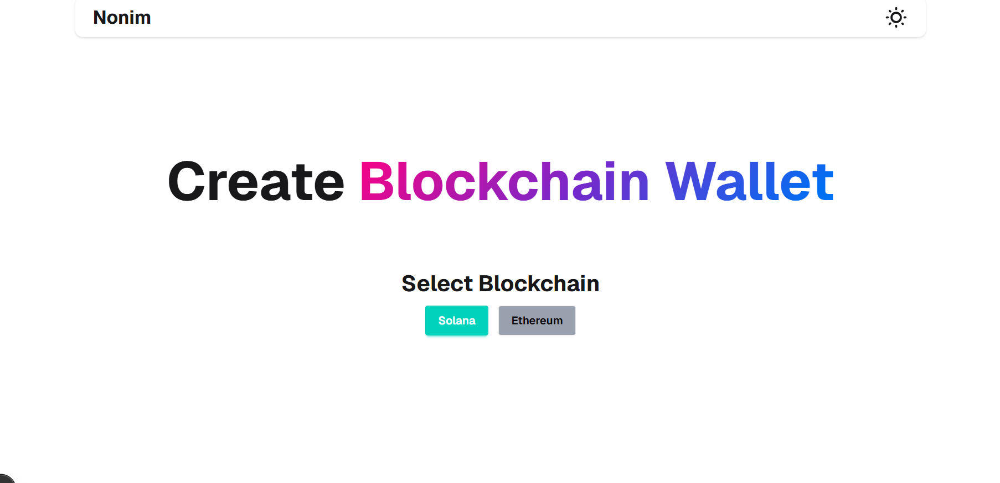
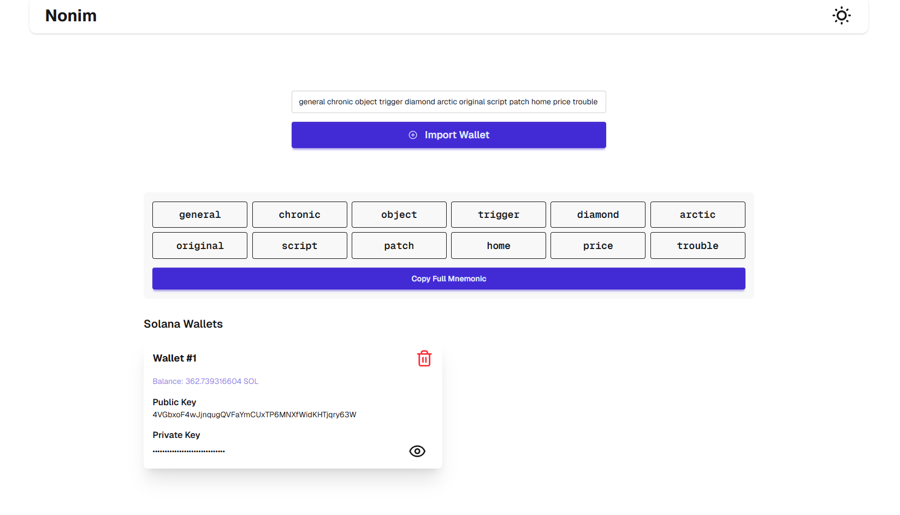

---

# 🔐 Nonim - Blockchain Wallet Generator

A sleek multi-chain wallet generator (Solana & Ethereum) built with **Next.js**, **TailwindCSS + daisyUI**, **web3.js**, **ethers.js**, and **BIP39**. Securely generate, import, and manage HD wallets in your browser — no backend needed.

## ✨ Features

* ✅ Generate HD wallets for **Solana** and **Ethereum**
* ✅ Import wallets using a **12-word mnemonic**
* ✅ View public/private keys (with toggle visibility)
* ✅ Copy keys and individual seed words with a click
* ✅ View real-time balances from:

  * 🔷 `api.devnet.solana.com` (Solana)
  * 🟠 `Etherscan API` (Ethereum)
* ✅ Full mnemonic display with copy word-by-word
* ✅ ⚡ Full-page loading spinner for smooth UX
* ✅ Data stored locally in **localStorage**
* ✅ Responsive UI with **daisyUI** components

---

## 🖼️ Screenshots

| Home UI (Select Chain)                                        | Wallet Display                         |
| -------------------------------------- | -------------------------------------- |
|  | !  |

---

## 🧱 Tech Stack

* **Frontend**: Next.js 15 / React Server Components
* **Styling**: Tailwind CSS + daisyUI
* **Solana SDK**: `@solana/web3.js`
* **Ethereum SDK**: `ethers.js`
* **Key Derivation**: `bip39`, `ed25519-hd-key`, `tweetnacl`
* **Storage**: `localStorage`
* **Icons**: `lucide-react`

---

## 🚀 Getting Started

### 1. Clone the repo

```bash
git clone https://github.com/yourusername/blockchain-wallet-generator.git
cd blockchain-wallet-generator
```

### 2. Install dependencies

```bash
npm install
# or
yarn
```

### 3. Add Etherscan API Key

Create a `.env.local` file:

```env
NEXT_PUBLIC_ETHERSCAN_API_KEY=your_key_here
```

> ✅ You can get a free API key at [etherscan.io/apis](https://etherscan.io/apis)

### 4. Run the app

```bash
npm run dev
```

Visit: `http://localhost:3000`

---

## 🛠 Build

```bash
npm run build && npm run start
```

---

## 📁 Project Structure

```
.
├── components/
│   ├── WalletCreate.tsx    # Core wallet generator
│   └── magicui/            # Fancy text components
├── pages/
├── public/
├── styles/
├── utils/                  # Optional: helpers if you refactor
└── ...
```

---

## 📦 Dependencies

```json
"@solana/web3.js": "^1.x",
"ethers": "^6.x",
"bip39": "^3.x",
"tweetnacl": "^1.x",
"ed25519-hd-key": "^1.x",
"lucide-react": "^latest",
"sonner": "^latest",
"daisyui": "^5.x",
"tailwindcss": "^3.x"
```

---

## 🔒 Security Notes

* ⚠️ This is a **client-only** wallet tool. It **does not store** or **transmit** private keys to any server.
* ⚠️ Use for **testing or educational purposes only**. Not recommended for storing large balances.

---

## 🙌 Acknowledgements

* [Solana Labs](https://solana.com/)
* [Ethers.js](https://docs.ethers.io/)
* [BIP39 Standard](https://github.com/bitcoin/bips/blob/master/bip-0039.mediawiki)
* [Tailwind CSS](https://tailwindcss.com/)
* [daisyUI](https://daisyui.com/)

---

## 📃 License

MIT © [Satypriyo](https://github.com/Satyapriyo)

